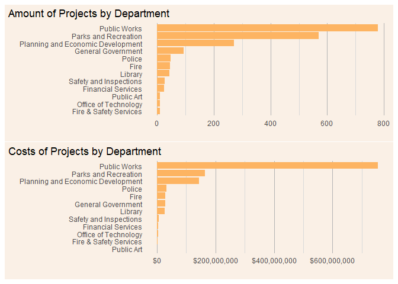
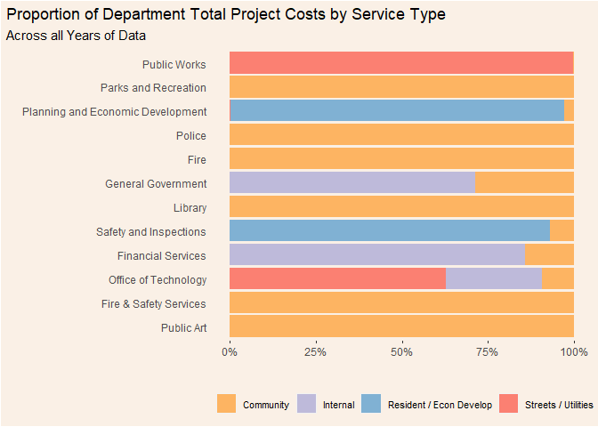
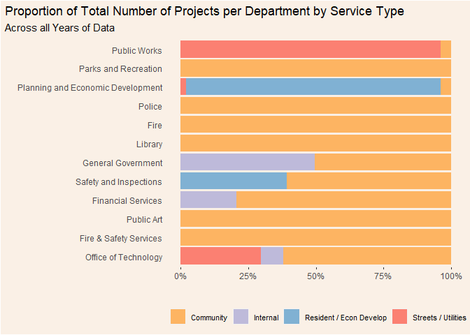

```r
library(readr)
library(tidyverse)
```

```
## -- Attaching packages --------------------------------------- tidyverse 1.3.0 --
```

```
## v ggplot2 3.3.3     v dplyr   1.0.4
## v tibble  3.1.0     v stringr 1.4.0
## v tidyr   1.1.2     v forcats 0.5.0
## v purrr   0.3.4
```

```
## Warning: package 'ggplot2' was built under R version 4.0.4
```

```
## Warning: package 'dplyr' was built under R version 4.0.4
```

```
## -- Conflicts ------------------------------------------ tidyverse_conflicts() --
## x dplyr::filter() masks stats::filter()
## x dplyr::lag()    masks stats::lag()
```

```r
library(patchwork)
library(lubridate)
```

```
## 
## Attaching package: 'lubridate'
```

```
## The following objects are masked from 'package:base':
## 
##     date, intersect, setdiff, union
```

```r
library(gganimate)
library(transformr)
library(gifski)
library(RColorBrewer)
```


```r
Adopted_Capital_Improvement_Budgets <- read_csv("Adopted_Capital_Improvement_Budgets.csv")
```

```
## 
## -- Column specification --------------------------------------------------------
## cols(
##   YEAR = col_double(),
##   SERVICE = col_character(),
##   TITLE = col_character(),
##   `ID #` = col_character(),
##   DEPARTMENT = col_character(),
##   LOCATION = col_character(),
##   DISTRICT = col_character(),
##   Description = col_character(),
##   FIN_CODE = col_character(),
##   Amount = col_double(),
##   LATITUDE = col_double(),
##   LONGITUDE = col_double()
## )
```

```r
Adopted_Capital_Improvement_Budgets %>% 
  mutate(across(where(is.character), as.factor)) %>% 
  summary()
```

```
##       YEAR                                      SERVICE   
##  Min.   :2004   Community Facilities                :790  
##  1st Qu.:2008   Internal Service                    :103  
##  Median :2012   Residential and Economic Development:283  
##  Mean   :2012   Streets and Utilities               :755  
##  3rd Qu.:2016                                             
##  Max.   :2021                                             
##                                                           
##                                                  TITLE               ID #     
##  Sidewalk Reconstruction Program                    :  45   SU-660821-1:  35  
##  Children's Play Area Improvements                  :  30   CF-660834  :  30  
##  Parks Grant Prep/Preliminary Design Program        :  30   CF-661054  :  30  
##  Bond Sale Costs                                    :  26   SU-662231  :  28  
##  Outdoor Court Restoration Program                  :  25   CF-660833  :  25  
##  Signalized Intersection Safety Improvements Program:  23   CF-660692-1:  24  
##  (Other)                                            :1752   (Other)    :1759  
##                              DEPARTMENT                   LOCATION   
##  Public Works                     :779   Citywide             : 613  
##  Parks and Recreation             :569   Internal Accounting  :  68  
##  Planning and Economic Development:271   1225 Estabrook Drive :  33  
##  General Government               : 94   Downtown area        :  16  
##  Police                           : 48   1325 Aida Place      :  15  
##  Fire                             : 45   891 North Dale Street:  14  
##  (Other)                          :125   (Other)              :1172  
##      DISTRICT  
##  Citywide:743  
##  0       :280  
##  5       : 83  
##  6       : 67  
##  17      : 57  
##  3       : 45  
##  (Other) :656  
##                                                                                                                                                                                                                                                                                                                                                                                                                                                                                                                                                                                                                                                                                                                                                                                                                                                                                                          Description  
##  A specified fund for Capital Maintenance work on City-owned facilities. This program funds the preservation of the City's physical assets.                                                                                                                                                                                                                                                                                                                                                                                                                                                                                                                                                                                                                                                                                                                                                                    : 459  
##  This is a citywide program established to improve the structural condition, safety and rideability of the city's street system.  This recurring program, which replaces the Residential Street Vitality Program, will include all city streets, both residential and arterial, and projects will be prioritized by Pavement Condition Index and Average Daily Traffic as the main criteria.                                                                                                                                                                                                                                                                                                                                                                                                                                                                                                                   :  58  
##  Based on the work of Gil Penalosa, an internationally renowned urban designer, this fund will allow the building of bold and vibrant places across the City of Saint Paul.  The 8-80 Vitality Fund will build on the momentum of recent investments such as Rebuild Saint Paul and the Green Line.  An 8-80 city works for people aged 8 and aged 80, by providing streets and public spaces that create vital and welcoming neighborhoods.\n\nInvestments include:\n$8M - Palace Theatre renovations to match State bonding\n$8M - Jackson Street reconstruction and phase 1 of downtown bike loop\n$13.2M - Grand Rounds, including street reconstruction and bike lanes\n$2M - Dickerman Park, developing green spaces on the Green Line\n$1.8M - Optical fiber infrastructure to provide high speed citywide network connectivity\n$9.5M - Street Reconstruction, including 8-80 streets and public spaces:  37  
##  Reconstruct hazardous and deteriorating sidewalks throughout the City.  The work locations are prioritized so as to correct most severe areas first.                                                                                                                                                                                                                                                                                                                                                                                                                                                                                                                                                                                                                                                                                                                                                          :  35  
##  Continuation of an annual program which facilitates the systematic replacement, renovation, and/or retrofitting of the City's existing children's play areas based on the Parks Asset Management System, the Parks and Recreation Vision and System Plan and other factors.                                                                                                                                                                                                                                                                                                                                                                                                                                                                                                                                                                                                                                   :  30  
##  To set aside a portion of the Capital Improvement Bond proceeds to cover the cost of issuing the bonds.                                                                                                                                                                                                                                                                                                                                                                                                                                                                                                                                                                                                                                                                                                                                                                                                       :  28  
##  (Other)                                                                                                                                                                                                                                                                                                                                                                                                                                                                                                                                                                                                                                                                                                                                                                                                                                                                                                       :1284  
##          FIN_CODE       Amount            LATITUDE       LONGITUDE     
##  CIB         :881   Min.   :    3300   Min.   : 0.00   Min.   :-93.20  
##  CDBG        :293   1st Qu.:   50000   1st Qu.: 0.00   1st Qu.:  0.00  
##  MSA         :217   Median :  165000   Median : 0.00   Median :  0.00  
##  Assessment  : 85   Mean   :  619176   Mean   : 8.59   Mean   :-17.79  
##  Street Bonds: 52   3rd Qu.:  467500   3rd Qu.: 0.00   3rd Qu.:  0.00  
##  PIA         : 38   Max.   :25000000   Max.   :45.00   Max.   :  0.00  
##  (Other)     :365                      NA's   :73      NA's   :73
```


```r
Adopted_Capital_Improvement_Budgets %>% 
  group_by(YEAR) %>% 
  summarize(year_amount = sum(Amount)) %>% 
  ggplot(aes(x = YEAR, y = year_amount)) +
  geom_col(fill = "#FDB462") +
  scale_y_continuous(labels = scales::dollar) +
  labs(title = "Yearly Total Adopted Capital Improvement Budgets",
       subtitle = "2004 - 2021",
       y = "",
       x = "") +
  theme(plot.title.position = "plot",
        plot.background = element_rect("linen"), 
        panel.background = element_rect("linen"),
        legend.background = element_rect("linen"),
        axis.ticks.y = element_blank(),
        panel.grid.major.y = element_line("grey70"),
        panel.grid.minor.y = element_line("grey85"),
        panel.grid.major.x = element_blank(),
        panel.grid.minor.x = element_blank())
```

<!-- -->


```r
g1 <- Adopted_Capital_Improvement_Budgets %>% 
  add_count(SERVICE, name = "counts") %>% 
  mutate(s_reorder = fct_reorder(SERVICE, counts, .fun = max)) %>% 
  ggplot(aes(y = s_reorder)) +
  geom_bar(fill = "#FDB462") +
  labs(title = "Amount of Projects by Service Type",
       x = "",
       y = "") +
  theme(plot.title.position = "plot",
        plot.background = element_rect("linen"), 
        panel.background = element_rect("linen"),
        legend.background = element_rect("linen"),
        axis.ticks.x = element_blank(),
        axis.ticks.y = element_blank(),
        panel.grid.major.x = element_line("grey70"),
        panel.grid.minor.x = element_line("grey85"),
        panel.grid.major.y = element_blank())

g2 <- Adopted_Capital_Improvement_Budgets %>% 
  mutate(Service_reorder = fct_reorder(SERVICE, Amount, sum)) %>% 
  ggplot(aes(x = Amount, y = Service_reorder)) +
  geom_col(fill = "#FDB462") +
  labs(title = "Costs of Projects by Service Type ($)",
       x = "",
       y = "") +
  scale_x_continuous(labels = scales::dollar) +
  theme(plot.title.position = "plot",
        plot.background = element_rect("linen"), 
        panel.background = element_rect("linen"),
        legend.background = element_rect("linen"),
        axis.ticks.x = element_blank(),
        axis.ticks.y = element_blank(),
        panel.grid.major.x = element_line("grey70"),
        panel.grid.minor.x = element_line("grey85"),
        panel.grid.major.y = element_blank())

service_g <- g1 / g2
service_g
```

<!-- -->


```r
g3 <- Adopted_Capital_Improvement_Budgets %>% 
  add_count(DEPARTMENT, name = "counts") %>% 
  mutate(d_reorder = fct_reorder(DEPARTMENT, counts, .fun = max)) %>% 
  ggplot(aes(y = d_reorder)) +
  geom_bar(fill = "#FDB462") +
  labs(title = "Amount of Projects by Department Type",
       x = "",
       y = "") +
  theme(plot.title.position = "plot",
        plot.background = element_rect("linen"), 
        panel.background = element_rect("linen"),
        legend.background = element_rect("linen"),
        axis.ticks.x = element_blank(),
        axis.ticks.y = element_blank(),
        panel.grid.major.x = element_line("grey70"),
        panel.grid.minor.x = element_line("grey85"),
        panel.grid.major.y = element_blank())

g4 <- Adopted_Capital_Improvement_Budgets %>% 
  mutate(department_reorder = fct_reorder(DEPARTMENT, Amount, sum)) %>% 
  ggplot(aes(x = Amount, y = department_reorder)) +
  geom_col(fill = "#FDB462") +
  labs(title = "Costs of Projects by Department ($)",
       x = "",
       y = "") +
  scale_x_continuous(labels = scales::dollar) +
  theme(plot.title.position = "plot",
        plot.background = element_rect("linen"), 
        panel.background = element_rect("linen"),
        legend.background = element_rect("linen"),
        axis.ticks.x = element_blank(),
        axis.ticks.y = element_blank(),
        panel.grid.major.x = element_line("grey70"),
        panel.grid.minor.x = element_line("grey85"),
        panel.grid.major.y = element_blank())

 department_g <- g3 / g4
 department_g
```

<!-- -->

> telling story with data: how have capital improvement budgets changed overtime?
> change in proportion of service type of projects overtime?
> how many projects per year were over the median value?


```r
Adopted_Capital_Improvement_Budgets %>% 
  mutate(department_reorder = fct_reorder(DEPARTMENT, Amount, sum)) %>%
  ggplot(aes(y = department_reorder, x = Amount, fill = SERVICE)) +
  geom_bar(position = "fill", stat = "identity") +
  scale_x_continuous(labels = scales::percent) +
  theme(legend.position = "right",
        legend.direction = "vertical",
        legend.text = element_text(size = 7),
        plot.title.position = "plot",
        plot.background = element_rect("linen"), 
        panel.background = element_rect("linen"),
        legend.background = element_rect("linen"),
        axis.ticks.y = element_blank(),
        panel.grid.major.x = element_blank(),
        panel.grid.minor.x = element_blank(),
        panel.grid.major.y = element_blank(),
        panel.grid.minor.y = element_blank()) +
  scale_fill_brewer(palette = "Set3") +
  labs(title = "Percent of Total Project Costs by Each Service Type",
       subtitle = "",
       x = "",
       y = "",
       fill = "") 
```

<!-- -->

```r
Adopted_Capital_Improvement_Budgets %>% 
  filter(DEPARTMENT == c("Parks and Recreation", "Police", "Fire", "Library", "Fire & Safety Services", "Public Art")) %>% 
  mutate(department_reorder = fct_reorder(DEPARTMENT, Amount, sum)) %>%
  ggplot(aes(x = YEAR, y = Amount, fill = department_reorder)) +
  geom_bar(position = "fill", stat = "identity") +
  scale_y_continuous(labels = scales::percent) +
  scale_fill_brewer(palette = "Set3") +
  labs(title = "Proportion of Yearly Community Facilities Project Costs by Department",
       x = "",
       y = "",
       fill = "") +
  theme(plot.title.position = "plot",
        plot.background = element_rect("linen"), 
        panel.background = element_rect("linen"),
        legend.background = element_rect("linen"),
        panel.grid.major.x = element_blank(),
        panel.grid.minor.x = element_blank(),
        panel.grid.major.y = element_blank(),
        panel.grid.minor.y = element_blank())
```

```
## Warning in DEPARTMENT == c("Parks and Recreation", "Police", "Fire",
## "Library", : longer object length is not a multiple of shorter object length
```

<!-- -->

